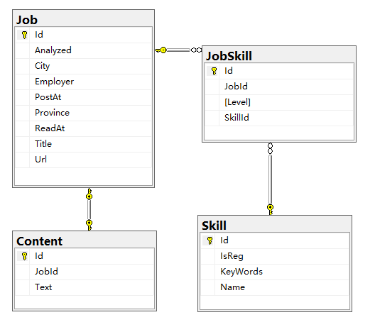

# jobboard.backend
A REST data service built with ASP.NET Core + EntityFramework Core + MySql

------
##Source code structure  
```
|-- src
    |-- jobboard.backend
    |   |-- appsettings.json          // contains configuration string such as db connection
    |   |-- fabfile.py                // python script for auto deploy with fabric
    |   |-- jobboard.backend.xproj
    |   |-- Program.cs
    |   |-- project.json
    |   |-- Startup.cs   // configure http pipeline, register services
    |   |-- web.config
    |   |-- Controllers  // do not need content and skill controllers
    |   |   |-- JobsController.cs
    |   |   |-- SkillsController.cs
    |   |-- Core
    |   |   |-- Extensions.cs
    |   |   |-- PaginationHeader.cs
    |   |   |-- Services
    |   |       |-- IWorkerService.cs
    |   |       |-- WorkerService.cs  // the service to trigger analyzer task (async call to flask)
    |   |-- Properties
    |   |   |-- launchSettings.json
    |   |-- ViewModels      // data transfer objects
    |   |   |-- ContentDto.cs
    |   |   |-- JobDetailDto.cs
    |   |   |-- JobDto.cs
    |   |   |-- JobSkillDto.cs
    |   |   |-- SkillDto.cs
    |   |   |-- SkillDtoValidator.cs
    |   |   |-- Mappings    // configuration for AutoMapper
    |   |       |-- AutoMappingConfiguration.cs
    |   |       |-- DomainToDtoMappingProfile.cs
    |   |       |-- DtoToDomainModelMappingProfile.cs
    |-- jobboard.Data
    |   |-- jobboard.Data.xproj
    |   |-- JobBoardContext.cs  // ef context for the whole project
    |   |-- project.json
    |   |-- Abstract
    |   |   |-- IEntityBaseRepository.cs
    |   |   |-- IRepositories.cs
    |   |-- Properties
    |   |   |-- AssemblyInfo.cs
    |   |-- Repositories
    |       |-- EntityBaseRepository.cs
    |       |-- JobRepository.cs
    |       |-- SkillRepository.cs
    |-- jobboard.Model          //data model project
        |-- IEntityBase.cs
        |-- jobboard.Model.xproj
        |-- project.json
        |-- Entities
        |   |-- Content.cs      // data model for the raw text of a job post
        |   |-- Job.cs          // data model for a job post
        |   |-- JobSkill.cs     // data model for the multi-multi relation between Job and Skill
        |   |-- Skill.cs        // data model for a skill, it has name and keywords
        |-- Properties
            |-- AssemblyInfo.cs
```
##Implementation key points
This section records some key points (or lesson learned) in the implementation, for future reference~

-----------
###Code first database design
This application has the following data models:  
  
* Job: Represent the core information of a job post.  
* Content: Represent the raw text information of a job post (its job description and requirements)  
* Skill: Represent a skill, such as `.NET`,`Java`, and its matching config (keywords based / regex based)  
* JobSkill: Skill required by a specific job, and the required level of experience  

User add __Skill__ along with the matching keywords/regex via frontend app.    
The Jobboard.Scraper retrieve info from recruitment websites, post the __Job__ and __Content__ to this backend, 
then the backend trigger the Jobboard.Analyzer to extract __JobSkill__ from the Content and write to the database. 

####Handle mayny to many relation
Many-to-many relationships without an entity class to represent the join table are not yet supported by EF Core. So a joining table entity __JobSkill__
is required as a bridge :   
In both __Job__ and __Skill__, there is a navigation property:
```C#
public ICollection<JobSkill> JobSkills { set; get; }
```
In __JobSkill__
```C#
public class JobSkill : IEntityBase
{
    public int Id { set; get; }
    public int JobId { set; get; }
    public Job Job { set; get; }
    public int SkillId {set;get;}
    public Skill Skill { set; get; }
    public int Level { set; get; }
}
```
The relations need to be specified in DbContext OnModelCreating():
```C#
modelBuilder.Entity<Job>()
            .HasMany(j => j.JobSkills)
            .WithOne(js => js.Job)
            .HasForeignKey(js => js.JobId);

modelBuilder.Entity<Skill>()
            .HasMany(s => s.JobSkills)
            .WithOne(js => js.Skill)
            .HasForeignKey(js => js.SkillId);
```
####Handle very long string datatable column  
The `Text` column in __Content__ is a very long string (detailed description of a job and its requirement), by default the `string` 
in EF will be mapped to nvarchar in MySql, which is not enough. Strangely, even if I add `.HasMaxLength(100000)` it still does not map to MySql `text`.
It works only after explicitely specify the column type:
```C#
modelBuilder.Entity<Content>()
            .Property(c => c.Text)
            .HasColumnType("text")
            .HasMaxLength(100000)
            .IsRequired();
```
###Startup configuration  
In ASP.NET Core, essential configurations are in Startup.cs file, basically it does 2 important things there: 1. Register services for dependency injection 
2. Configure HTTP pipeline  
Below is some lesson learned / good practices  
####Enable CORS
Due to the separation of frontend and backend in this project, CORS must be enabled. To enable CORS in ASP.NET Core, 2 steps are needed:  
```C#
public void ConfigureServices(IServiceCollection services)
{
    ......
    // Enable Cors
    services.AddCors();
    ......
}
```
```C#
public void Configure(IApplicationBuilder app, IHostingEnvironment env, ILoggerFactory loggerFactory)
{
    ......        
    app.UseCors(builder =>
                builder.AllowAnyOrigin()
                .AllowAnyHeader()
                .AllowAnyMethod());
    ......
}
```
####Use a global exception handler
Instead of polluting the code with try/catch blocks everywhere, in ASP.NET Core we could add a global Exception Handler into the pipeline.
```C#
app.UseExceptionHandler(
    builder =>
    {
        builder.Run(
            async context =>
            {
                context.Response.StatusCode = (int)HttpStatusCode.InternalServerError;
                context.Response.Headers.Add("Access-Control-Allow-Origin", "*");

                var error = context.Features.Get<IExceptionHandlerFeature>();
                if (error != null)
                {
                    context.Response.AddApplicationError(error.Error.Message); 
                    await context.Response.WriteAsync(error.Error.Message).ConfigureAwait(false);
                }
            });
    });
```
####Specify EntityBaseRepository migration assembly
The EF `DbContext` and the app `Startup` are defined in different assemblies, 
so if we run 
```Bash
dotnet ef migrations add init
```
It will fail, to make it work, it is mandatory to add the following configuration in Startup when register DbContext:
```C#
services.AddDbContext<JobBoardContext>(options =>
    options.UseMySQL(Configuration["JobBoardConnection:ConnectionString"],
    b => b.MigrationsAssembly("jobboard.backend"))
    .ConfigureWarnings(warnings => warnings.Throw(RelationalEventId.QueryClientEvaluationWarning)));
```
####Configure Automapper mapping strategy
AutoMapper is used to convert between entity to dto (view model), a static configuring method is defined and called from the Startup:
```C#
public class AutoMappingConfiguration
{
    public static void Configure()
    {
        Mapper.Initialize(x =>
        {
            x.AddProfile<DomainToDtoMappingProfile>();
            x.AddProfile<DtoToDomainModelMappingProfile>();
        });
    }
}
```
```C# 
public void ConfigureServices(IServiceCollection services)
{
    ......
    AutoMappingConfiguration.Configure();
    ......
}
```
##Deployment key points
This section records some key points for deploying asp.net core on linux, for future reference~

-----------
###Install .NET Core runtime on linux server
```Bash
sudo yum install libunwind libicu
curl -sSL -o dotnet.tar.gz https://go.microsoft.com/fwlink/?LinkID=836285
sudo mkdir -p /opt/dotnet && sudo tar zxf dotnet.tar.gz -C /opt/dotnet
sudo ln -s /opt/dotnet/dotnet /usr/local/bin
```
Note: the `836285` might need to be changed to reflect the version upgrade

###Start .Net Core Application
1. Build and publish the app to a folder
2. Upload the folder to server
3. On the server, cd the folder, then run:
```Bash
dotnet jobboard.backend.dll
```
The app will be started, be aware that at this point it can only be visited from localhost:5000 (the server itself) since 
the integrated Kestrel server is not ready to be a full server yet~
So we still need something like nginx to reverse proxy the http request

###Configure Nginx as reverse proxy
Add a Nginx configuration file:
```Bash
server {
listen       8080;  //I use 8080 as the port for backend, since I deploy the frontend on the same server
server_name localhost;

access_log  /var/log/jobboard.backend.access.log;
error_log  /var/log/jobboard.backend.error.log;
location / {
    proxy_pass  http://localhost:5000;
    proxy_http_version 1.1;
    proxy_set_header Upgrade $http_upgrade;
    proxy_set_header Connection keep-alive;
    proxy_set_header Host $host;
    proxy_cache_bypass $http_upgrade;
    }
}
```
###Use supervisord to daemon the app server
TODO
###Use Python Fabric to automate the deployment
TODO

